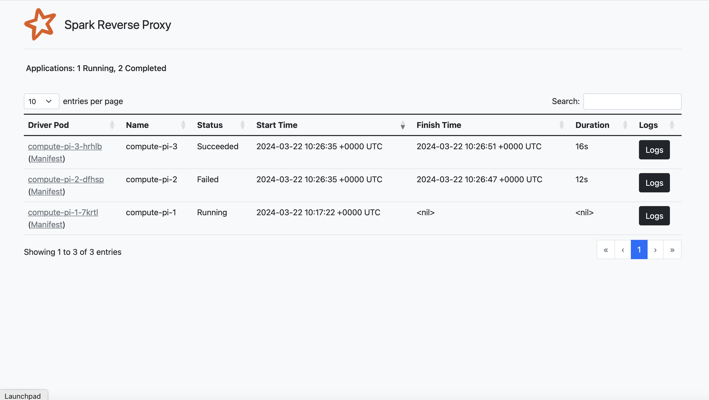

# Spark UI for Kubernetes


This is a simple Spark UI reverse proxy to ease accessing the UI when working with Kubernetes.

## Screenshots

Home Page :


Driver's Logs Page :


Driver's Manifest Page :


## Usage

```
docker pull helkaroui/spark-reverse-proxy:latest
```

## Setup

The reverse proxy relies on label selection to list spark drivers, thus you need to add the following label depending on
submission mode :
- In client mode: you need to add the label `spark-role=driver` and expose port 4040
- In cluster mode: all labels are already added by default

In the spark submit command, you need to enable reverse proxy as follows :
```bash
/opt/spark/bin/./spark-submit \
    --master k8s://https://kubernetes.default.svc:443 \
    --deploy-mode client \
    --name $JOB_NAME \
    ...\
    --conf spark.ui.reverseProxy=true \
    file:///opt/spark/examples/jars/spark-examples_2.12-3.5.0.jar "$1"
```

## Development
This project requires :
- skaffold
- kustomize
- kind (for testing on kubernetes cluster)

To install these dependencies, run the following commands
```bash
# macos
brew install skaffold kustomize kind

# linux
apt install skaffold kustomize kind
```

To start modifying the source code, read the [developers guide](test/README.md).
